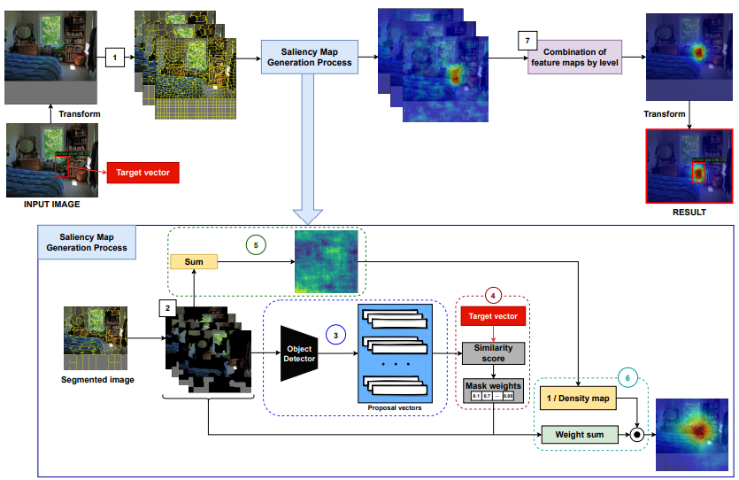

# D-CLOSE
This repository is an official implementation of the paper [Towards Better Explanations for Object Detection](https://arxiv.org/pdf/2306.02744.pdf).
## Overview
<div align="center">
  
</div>
<p align="center">
  Figure 1: Pipeline of D-CLOSE.
</p>

**Abstract.** Recent advances in Artificial Intelligence (AI) technology have promoted their use in almost every field. The growing complexity of deep neural networks (DNNs) makes it increasingly difficult and important to explain the inner workings and decisions of the network. However, most current techniques for explaining DNNs focus mainly on interpreting classification tasks. This paper proposes a method to explain the decision for any object detection model called D-CLOSE. To closely track the model’s behavior, we used multiple levels of segmentation on the image and a process to combine them. We performed tests on the MSCOCO dataset with the YOLOX model, which shows that our method outperforms D-RISE and can give a better quality and less noise explanation.

## License
This project is released under the [CC0-1.0 license](./LICENSE).

## Citing D-CLOSE
```bibtex
@article{truong2023towards,
  title={Towards Better Explanations for Object Detection},
  author={Truong, Van Binh and Nguyen, Truong Thanh Hung and Nguyen, Vo Thanh Khang and Nguyen, Quoc Khanh and Cao, Quoc Hung},
  journal={arXiv preprint arXiv:2306.02744},
  year={2023}
}
```
